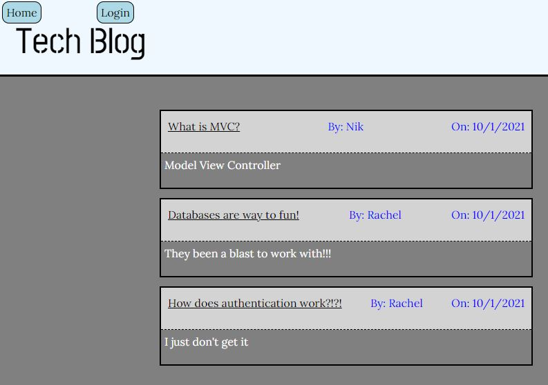

# Tech Blog

# Table of Contents

[Description](#description) -
[Usage](#usage) - 
[Technologies](#technologies) -
[Links](#links) - 
[Contact](#contact) -
[Technologies](#technologies) -
[License](#license)

## Description

This is a tech blog app designed with user authentication in mind. It uses a MVC format to send and recieve information from the server. The models are created using sequelize for an SQL database. The controllers are built using Express to create API calls and render the page when requested. The views are rendered using handlebars, with a few custom helpers. User status uses express-sessions to save the user id as well as a boolean as to determine if the user is logged in or not currently.

The site features a home landing page that shows all current blog posts. This page also has the option to go to the login page or click on the title of a blog post to view it and the comments as long as the user is signed in. Otherwise it will redirect the user to the login or signup page. Each user also has a dashboard which features the posts that they have made. This functions similarly to the homepage. When on a singular posts page you are able to add comments to the post. If you are the user that made the post there are buttons that allow the user to either update or delete the post. When a post is deleted so are all of the comments associated with it. After 1 day the session will expire requiring the user to relogin before being able to comment, update, delete, or create a new post.

## Install

Please use **'npm i'** in the command line to install the dependencies. This program uses sequelize, mysql2, express, and dotenv.

Before you begin please also update the **'.env.EXAMPLE'** file to include your information for SQL. Then rename the file to **'.env'**. Without this step the program will not run.

Before usage please in a MySQL terminal use **'source db/schema.sql;'**, this will create the database.

Also in the regular node terminal use **'npm run seed'**, this will seed the database with data.

## Usage

When ready use **'npm start'** into the command line to run.

## Links

 
[Walkthrough Video](https://www.youtube.com/watch?v=-hmA0-w6QF0)  
[Deployed App](https://aqueous-taiga-49039.herokuapp.com/)  
[GitHub](https://github.com/niklasertle/nje-tech-blog)

## Contact

[GitHub Profile](https://github.com/niklasertle) 
Email: nik.ertle16@gmail.com

## Technologies

## License

[MIT License Copyright (c) 2021 niklasertle](LICENSE)
